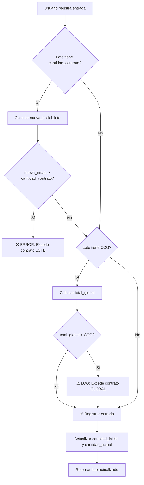

# 📋 Validación Dual de Contratos

## ISS-INV-001 + ISS-INV-003: Sistema de Doble Validación

El sistema implementa **dos niveles de validación de contratos** que trabajan en conjunto:

---

## 🔹 Nivel 1: Cantidad Contrato Individual (`cantidad_contrato`)

**Campo:** `cantidad_contrato` en tabla `Lote`

**Alcance:** Este lote específico

**Propósito:** Limitar la cantidad máxima que puede recibir **ESTE lote individual**

### Ejemplo Práctico

```
Lote A:
  numero_lote: "LOT-2025-001"
  producto: Paracetamol 500mg
  numero_contrato: "CONTRATO-2025-SSA-001"
  cantidad_contrato: 200        ← Límite de ESTE lote
  cantidad_inicial: 150
```

**Validación:** Este lote **NO puede** recibir más de 200 unidades totales.

- ✅ Entrada de 50 unidades: OK (150 + 50 = 200, dentro del límite)
- ❌ Entrada de 100 unidades: **RECHAZADA** (150 + 100 = 250 > 200)

**Error mostrado:**
```
"La entrada excede el contrato de ESTE LOTE. 
Contrato lote: 200, Ya recibido en lote: 150, 
Intentando agregar: 100, Excedente: 50"
```

---

## 🌐 Nivel 2: Cantidad Contrato Global (`cantidad_contrato_global`)

**Campo:** `cantidad_contrato_global` en tabla `Lote`

**Alcance:** Todos los lotes con el mismo `producto` + `numero_contrato`

**Propósito:** Limitar la cantidad total contratada para una **clave de producto específica** a través de múltiples entregas

### Ejemplo Práctico

```
Contrato: "CONTRATO-2025-SSA-001"
Producto: Paracetamol 500mg (clave 615)
Cantidad Contrato Global: 1000 unidades

Lote A:
  numero_lote: "LOT-2025-001"
  cantidad_contrato: 300        ← Límite individual
  cantidad_contrato_global: 1000 ← Límite compartido
  cantidad_inicial: 290

Lote B:
  numero_lote: "LOT-2025-002"
  cantidad_contrato: 400
  cantidad_contrato_global: 1000 ← Mismo límite global
  cantidad_inicial: 380

Lote C:
  numero_lote: "LOT-2025-003"
  cantidad_contrato: 300
  cantidad_contrato_global: 1000 ← Mismo límite global
  cantidad_inicial: 290
```

**Validación Global:** La suma de `cantidad_inicial` de todos los lotes **NO debería** exceder 1000.

- Total actual: 290 + 380 + 290 = **960 unidades**
- Pendiente global: 1000 - 960 = **40 unidades**

### Intentos de Entrada

#### ✅ Entrada dentro del límite global

```
Lote A: entrada de 10 unidades
Nueva suma: 960 + 10 = 970 ≤ 1000 ✅
``` 

**Solo genera ALERTA (no bloquea)** porque se validó previamente al crear el lote.

#### ⚠️ Entrada excede límite global

```
Lote B: entrada de 50 unidades
Nueva suma: 960 + 50 = 1010 > 1000 ⚠️
Excedente: 10 unidades
```

**Comportamiento:** Genera **ADVERTENCIA en logs** pero NO bloquea la operación.

**Log mostrado:**
```
⚠️ ALERTA: Entrada excede contrato GLOBAL. 
CCG: 1000, Total ya recibido: 960, 
Agregando: 50, Exceso: 10
```

---

## 🔄 Validación Secuencial

Cuando se registra una entrada, el sistema valida **EN ORDEN**:

### 1️⃣ Validación Contrato Individual (BLOQUEA)

```python
# Si existe cantidad_contrato del lote:
nueva_inicial_lote = lote.cantidad_inicial + entrada
if nueva_inicial_lote > lote.cantidad_contrato:
    raise ValidationError("Excede contrato de ESTE LOTE")
```

### 2️⃣ Validación Contrato Global (ADVIERTE)

```python
# Si existe cantidad_contrato_global:
total_proyecto = sum(lotes_hermanos.cantidad_inicial) + entrada
if total_proyecto > cantidad_contrato_global:
    logger.warning("⚠️ Excede contrato GLOBAL")
    # NO bloquea, solo registra alerta
```

---

## 📊 Visualización en Frontend

### Tabla de Lotes

| Lote | 📋 Contrato | 🌐 CCG | Pendiente Global |
|------|------------|--------|------------------|
| LOT-001 | 300 | 1000 | 40 🟢 |
| LOT-002 | 400 | 1000 | 40 🟢 |
| LOT-003 | 300 | 1000 | -10 🔴 |

### Código de Colores

- 🔴 **Rojo:** Excedido (pendiente negativo)
- 🟠 **Naranja:** Pendiente > 0
- 🟢 **Verde:** Completo (pendiente = 0)

---

## 🧪 Ejemplos de Casos de Uso

### Caso 1: Entrega única completa

```
Contrato: 500 unidades de Ibuprofeno
Lote único:
  cantidad_contrato: 500
  cantidad_contrato_global: 500
  cantidad_inicial: 500

✅ Completo, pendiente = 0
```

### Caso 2: Entregas parciales múltiples

```
Contrato: 1000 unidades de Amoxicilina
Lote 1: 400 unidades (contrato lote: 400, CCG: 1000)
Lote 2: 350 unidades (contrato lote: 350, CCG: 1000)
Lote 3: 200 unidades (contrato lote: 300, CCG: 1000)

Total: 950
Pendiente global: 50 unidades
```

### Caso 3: Ajuste posterior (entrada adicional)

```
Lote ya registrado:
  cantidad_inicial: 200
  cantidad_contrato: 250
  cantidad_contrato_global: 1000

Entrada de 30 unidades:
  ✅ Valida individual: 200 + 30 = 230 ≤ 250 ✅
  ✅ Valida global: (suma total) ≤ 1000 ✅
  
Resultado:
  Nueva cantidad_inicial: 230
  Nueva cantidad_actual: 230
```

### Caso 4: Exceso en lote individual

```
Lote:
  cantidad_inicial: 200
  cantidad_contrato: 200
  cantidad_contrato_global: 1000

Entrada de 50 unidades:
  ❌ Valida individual: 200 + 50 = 250 > 200 ❌
  
Resultado: ERROR BLOQUEANTE
"La entrada excede el contrato de ESTE LOTE"
```

### Caso 5: Exceso en contrato global

```
Contrato Global: 1000
Lotes existentes: 960 total

Lote A (dentro de su límite individual):
  cantidad_inicial: 290
  cantidad_contrato: 400
  
Entrada de 60 unidades:
  ✅ Valida individual: 290 + 60 = 350 ≤ 400 ✅
  ⚠️ Valida global: 960 + 60 = 1020 > 1000 ⚠️
  
Resultado: 
  - Operación se ejecuta
  - Se registra ADVERTENCIA en logs
  - Frontend muestra pendiente global en ROJO (-20)
```

---

## 🎯 Reglas de Negocio

1. **`cantidad_contrato` es ESTRICTO:** Si está definido, NO se puede exceder. Bloquea entradas.

2. **`cantidad_contrato_global` es INFORMATIVO:** Si se excede, genera alerta pero no bloquea (puede haber ajustes autorizados).

3. **CCG se hereda automáticamente:** Al crear un lote con el mismo `producto + numero_contrato`, si no se especifica CCG, se hereda de lotes hermanos.

4. **Salidas NO afectan validaciones:** Solo se validan entradas. Las salidas reducen `cantidad_actual` pero no `cantidad_inicial`.

5. **Ambas validaciones son independientes:** Un lote puede estar completo individualmente pero el contrato global aún tener pendiente.

---

## 🔧 Implementación Técnica

### Backend

**Archivo:** `backend/inventario/views_legacy.py`
- Función: `registrar_movimiento_stock()`
- Líneas 853-879: Validación dual en entradas

**Archivo:** `backend/core/serializers.py`
- Clase: `LoteSerializer`
- Método: `validate()` (líneas 1203-1248)
- Campo computed: `get_cantidad_pendiente_global()` (líneas 1060-1085)

### Frontend

**Archivo:** `inventario-front/src/pages/Lotes.jsx`
- Tabla con iconos 📋 (contrato lote) y 🌐 (CCG)
- Colores dinámicos según pendiente_global
- Formulario con campo CCG (solo admin)

### Tests

**Archivo:** `backend/tests/test_contrato_global.py`
- 56 tests totales
- Clase `TestValidacionDual`: 4 tests específicos de validación dual

---

## 📈 Flujo Completo



---

## 📝 Conclusión

El sistema de validación dual permite:

- **Control estricto** de entregas individuales por lote
- **Visibilidad global** del cumplimiento de contratos por clave
- **Flexibilidad** para ajustes autorizados en el nivel global
- **Trazabilidad completa** de recepciones y excedentes

Ambos niveles trabajan en conjunto para garantizar la integridad contractual mientras permiten la operación fluida del sistema.
